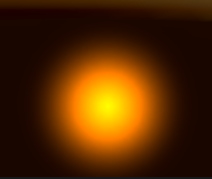
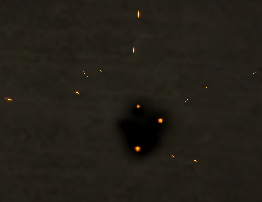

# explosion特效 unity

位置

"Set Velocity from Direction & Speed (Spherical)" is not on my node list, how did you add it?

go to Edit -> Preferences -> Visual Effects and check the box that says "Experimental Operators/Blocks"

### SPARKS （粒子溅射）部分

沿着力的方向

### FLASH

### FIRE

### SMOKE

把fire复制一下（圈出来的是他的不同之处）无非是比fire慢一点 停留在画面上久一点

### 效果

### 后处理

加个bloom

### 改进

自己加了一个圈

慢放

