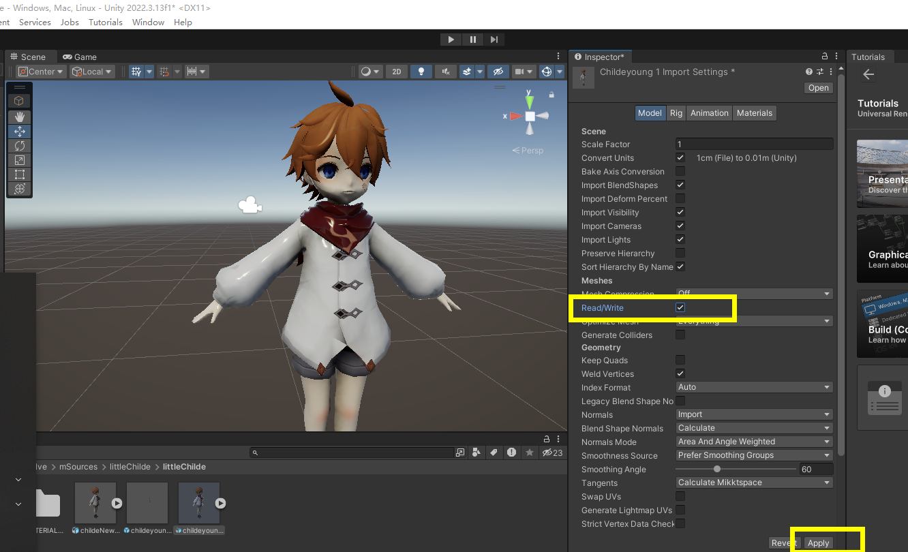
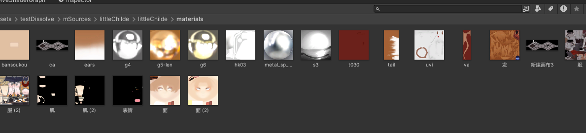
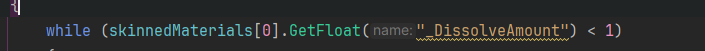
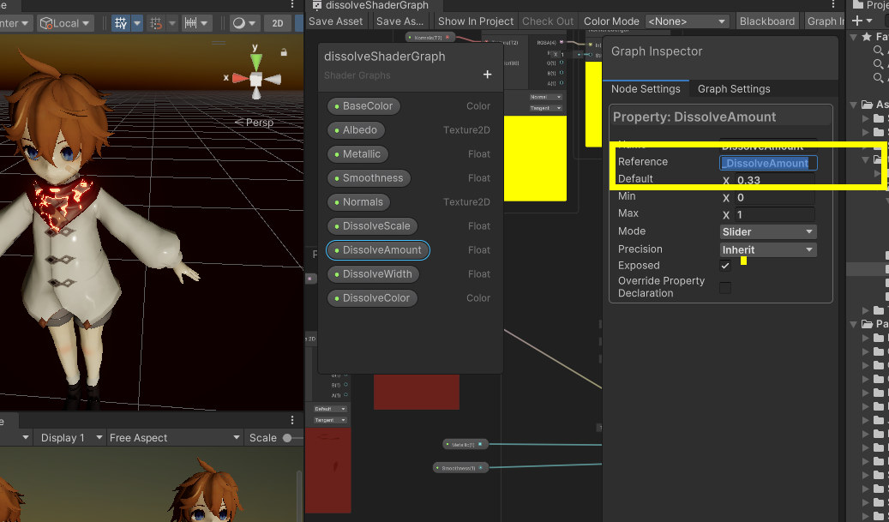
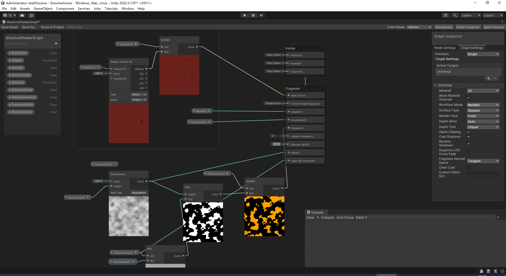
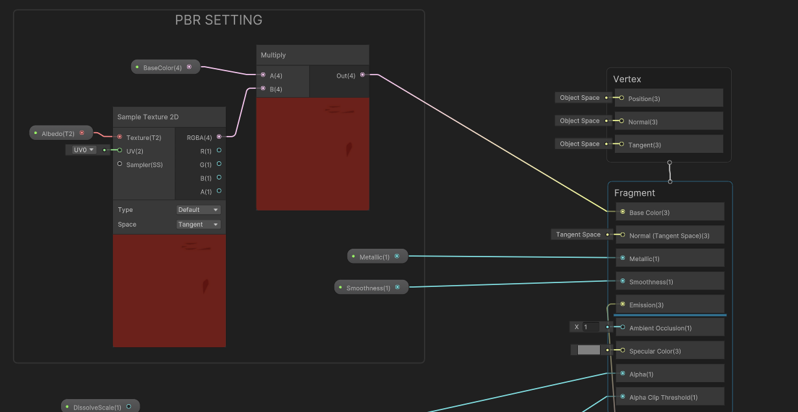
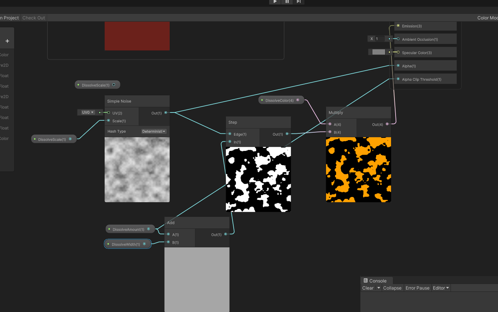
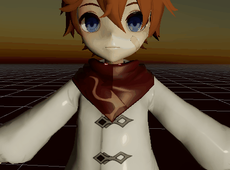

# dissolve 消融 消失 瓦解 unity shader















具体：





控制消融代码：

```C#
using System.Collections;
using System.Collections.Generic;
using UnityEngine;

public class DissolvingControllery : MonoBehaviour
{
    public SkinnedMeshRenderer skinnedeMesh;

    private Material[] skinnedMaterials;

    public float dissolveRate = 0.0125f;

    public float refreshRate = 0.025f;
    // Start is called before the first frame update
    void Start()
    {
        if (skinnedeMesh != null)
        {
            skinnedMaterials = skinnedeMesh.materials;
        }
    }

    // Update is called once per frame
    void Update()
    {
        if (Input.GetKeyDown(KeyCode.Space))
        {
            StartCoroutine(DissolveCo());
        }
    }

    IEnumerator DissolveCo()
    {
        if (skinnedMaterials.Length > 0)
        {
            float counter = 0;
            if (skinnedMaterials[0].GetFloat("_DissolveAmount") != null)
            {
                while (skinnedMaterials[0].GetFloat("_DissolveAmount") < 1)
                {
                    counter += dissolveRate;
                    for (int i = 0; i < skinnedMaterials.Length; i++)
                    {
                        skinnedMaterials[i].SetFloat("_DissolveAmount",counter);
                    }

                    yield return new WaitForSeconds(refreshRate);
                }
            }
        }
    }
}

```


