# 切割 分割 爆破 fracture


添加资源 例如

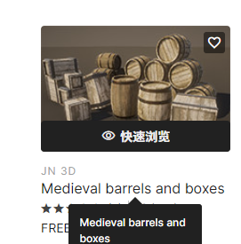


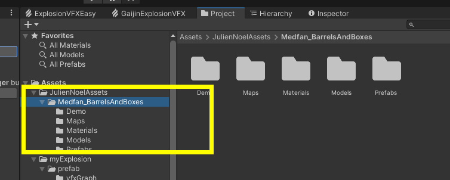


使用破碎特效

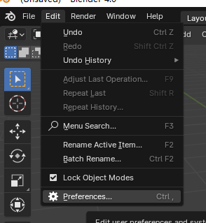

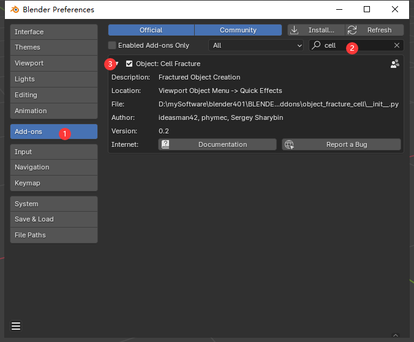


#### 对箱子进行分割

要细分不然会有bug

l（选中一圈？）+p（分割）

分割开

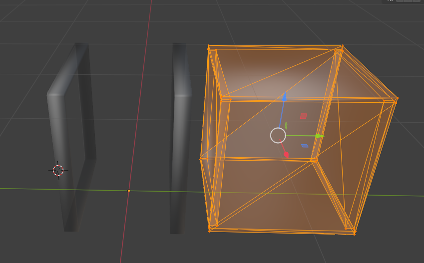


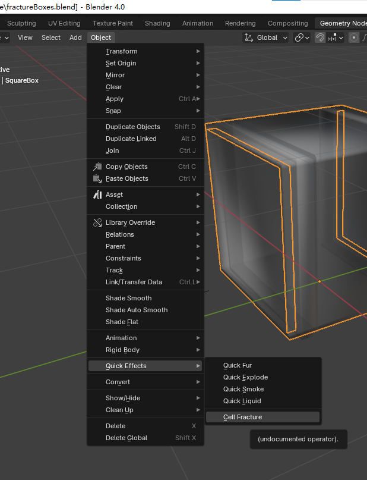

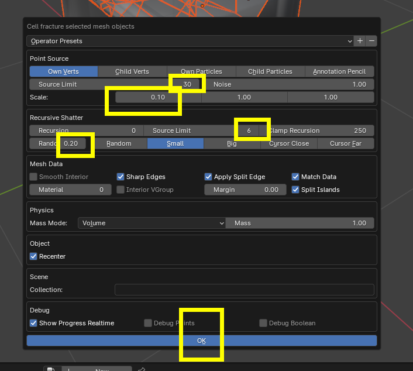

碎了 但是是实心的

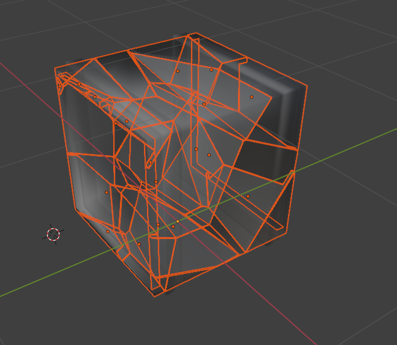


##### 加厚度 

我们给他价加个厚度，就不会了：

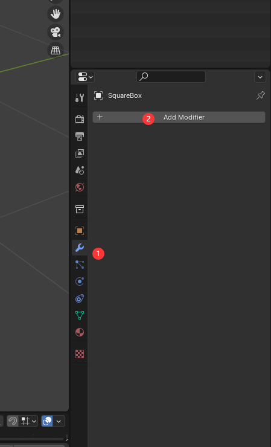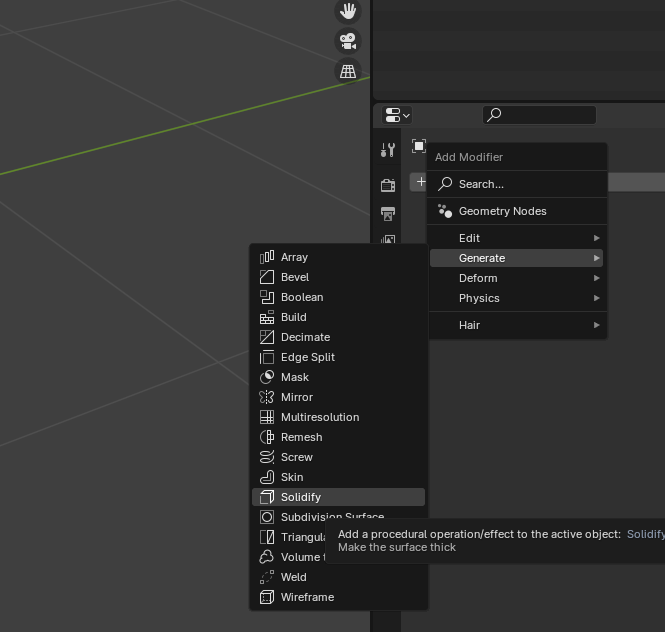


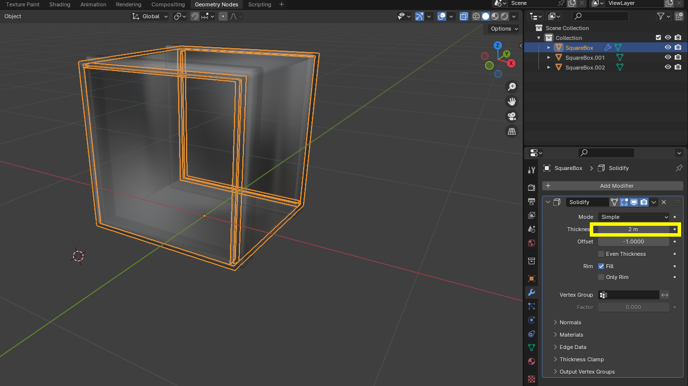

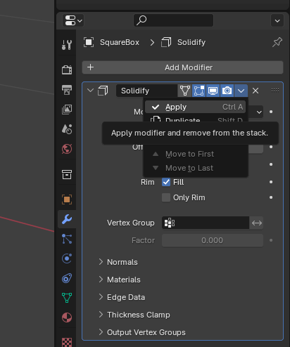


因为有问题 咱就换一个模型再试试hh

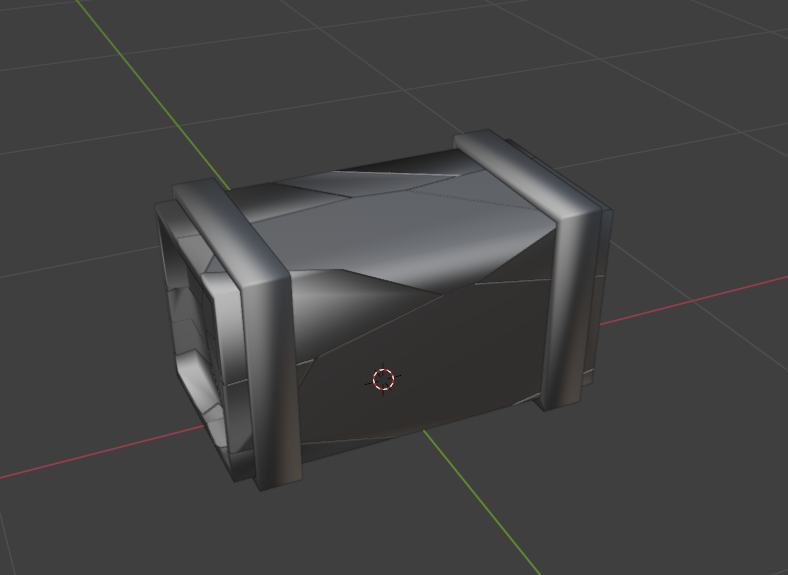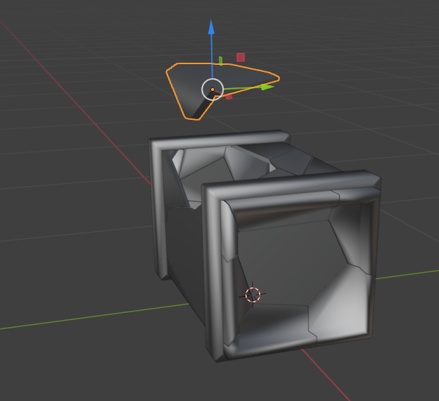


blender语法：

点击物体并tab选中

点击小键盘的“/”进入isolate模式

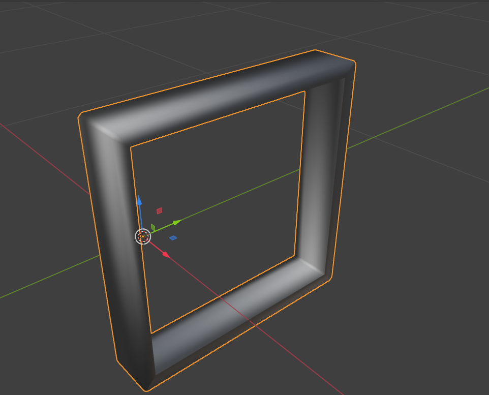

分为两部分

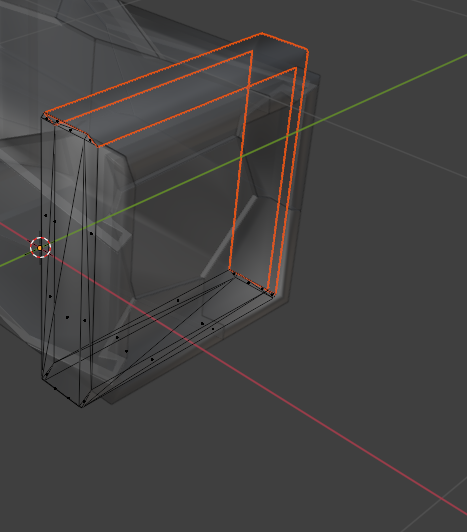


分块

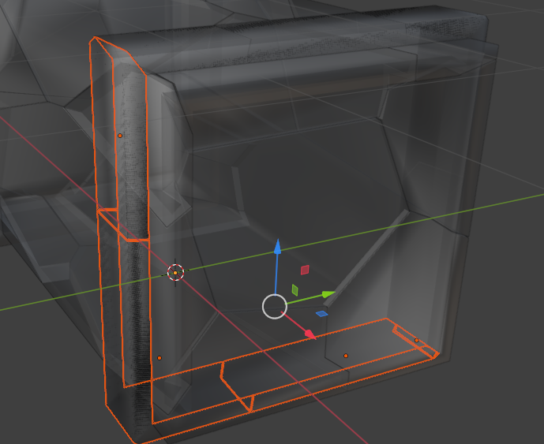

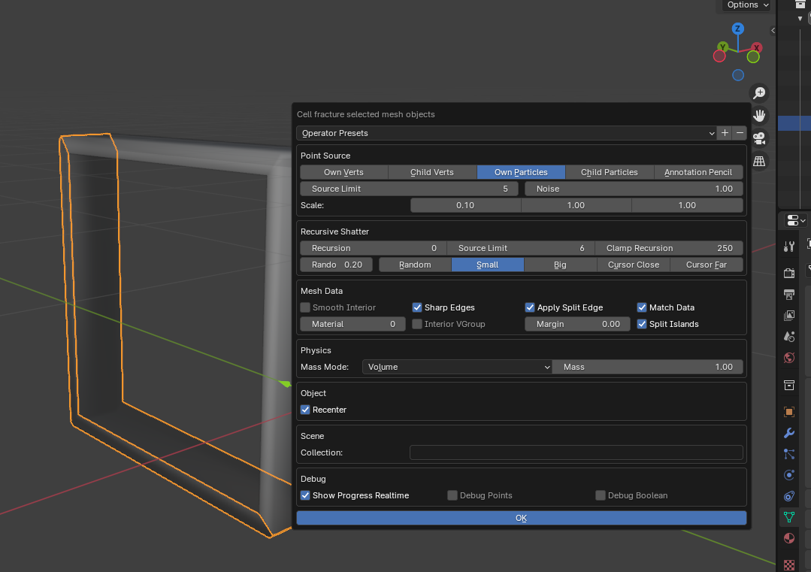

有问题就再切一次


添加材质

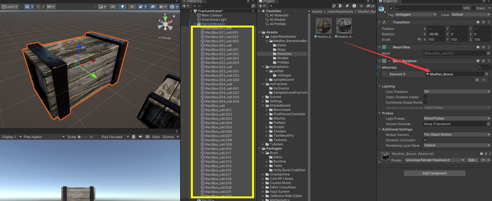


加刚体

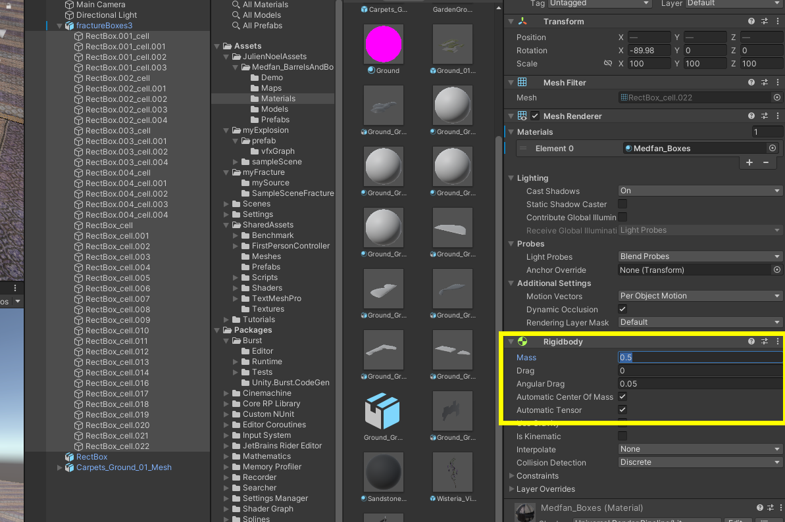

加collider

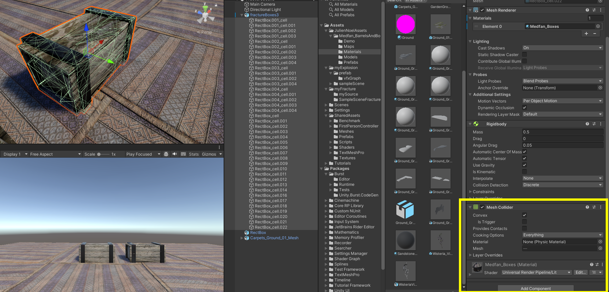


此时 运行已经可以碎了 （已经可以做很多东西了hh）

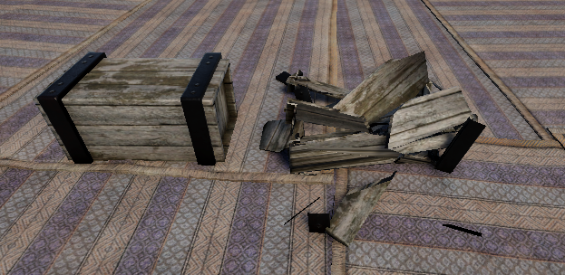

#### 爆炸代码

```C#
using System.Collections;
using System.Collections.Generic;
using Unity.Mathematics;
using UnityEngine;
using Random = UnityEngine.Random;

public class mFractureObject : MonoBehaviour
{
    public GameObject originalObject;
    public GameObject fractureObject;

    public GameObject mexplosionVFX;

    private GameObject fractureGO;

    public float minExplosionForce, maxExplosionForce;

    public float mExplosionRadius;

    private Transform vfxPlace;
    private Vector3 vfxV3;
    [Header("shrink")] 
    public float delaytime=2f;

    public float SrinkScaleRefresh = 10f;

    // Start is called before the first frame update
    void Start()
    {
        //
        // vfxPlace.position = new Vector3(originalObject.transform.position.x, originalObject.transform.position.y,
        //     originalObject.transform.position.z);
        vfxV3= new Vector3(originalObject.transform.position.x, originalObject.transform.position.y,
            originalObject.transform.position.z);
        print(originalObject.transform.position.x+" "+originalObject.transform.position.y+" "+
            originalObject.transform.position.z);
    }

    // Update is called once per frame 
    void Update()
    {
        if (Input.GetKeyDown(KeyCode.Space))//当然这是可以改的
        {
            print("l");
            Explode();
        }
    }

    public void Explode()
    {
        if (originalObject != null)
        {
            originalObject.SetActive(false);
        }

        if (fractureObject != null)
        {
            fractureGO = Instantiate(fractureObject,vfxV3,quaternion.identity) as GameObject;
            foreach (Transform tPiece in fractureGO.transform)
            {
                Rigidbody rb = tPiece.GetComponent<Rigidbody>();
                if (rb != null)
                {
                    //让他们崩开
                    rb.AddExplosionForce(Random.Range(minExplosionForce,maxExplosionForce),vfxV3,mExplosionRadius);
                }
                //慢慢变小小时
                StartCoroutine(Shrink(tPiece));
            }
            Destroy(fractureGO,10f);
        }

        if (mexplosionVFX != null)
        {
            GameObject exploVFX = Instantiate(mexplosionVFX,vfxV3,Quaternion.identity) as GameObject;
            print("ll");
            Destroy(exploVFX,10f);
        }
    }

    IEnumerator Shrink(Transform tpiece)
    {
        yield return new WaitForSeconds(delaytime);
        Vector3 newScale = tpiece.localScale;

        while (newScale.x >= 0)
        {
            newScale -= new Vector3(SrinkScaleRefresh, SrinkScaleRefresh, SrinkScaleRefresh);
            tpiece.localScale = newScale;
            yield return new WaitForSeconds(0.05f);
        }

        if (newScale.x - SrinkScaleRefresh<0)
        {
            tpiece.localScale = new Vector3(0,0,0);
        }

        // yield return new WaitForSeconds(1f);
    }
}

```


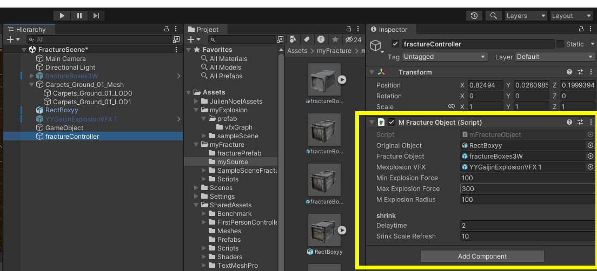

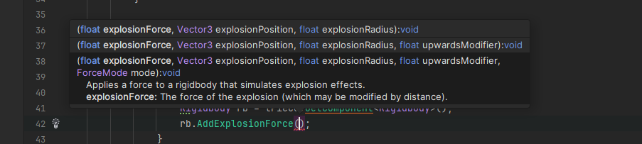


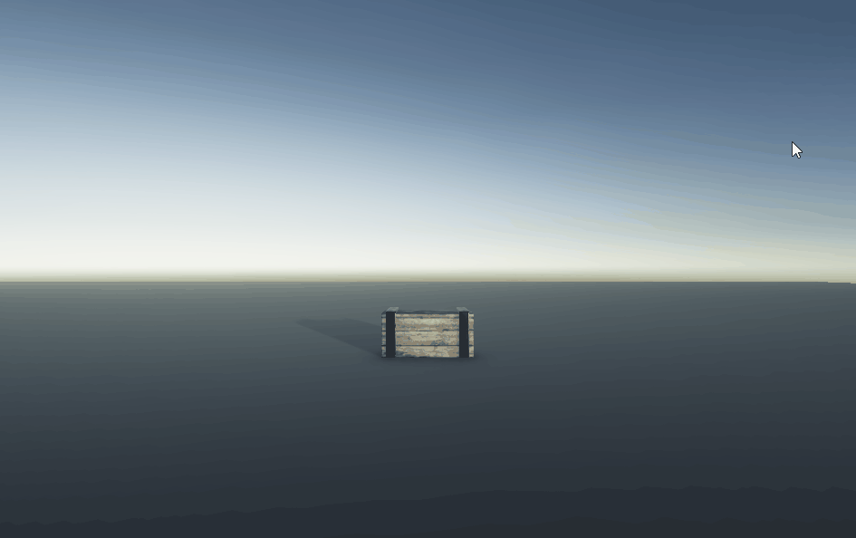
